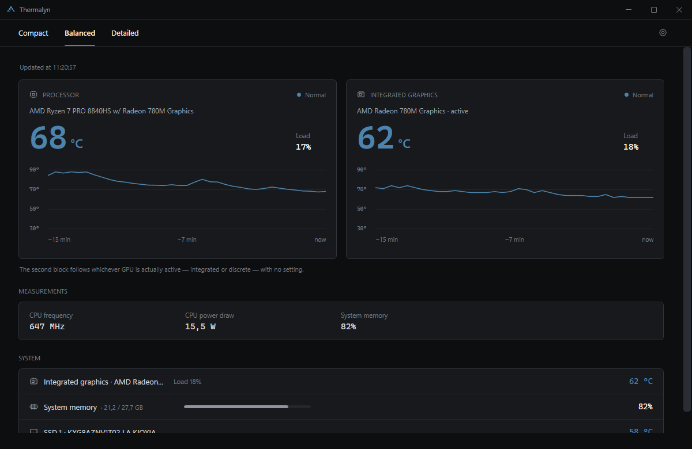
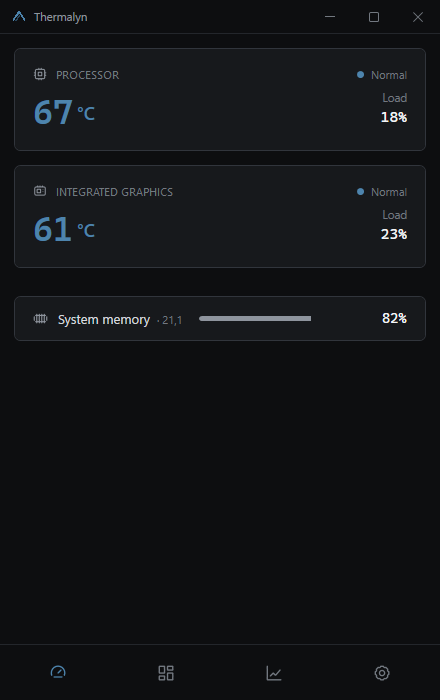
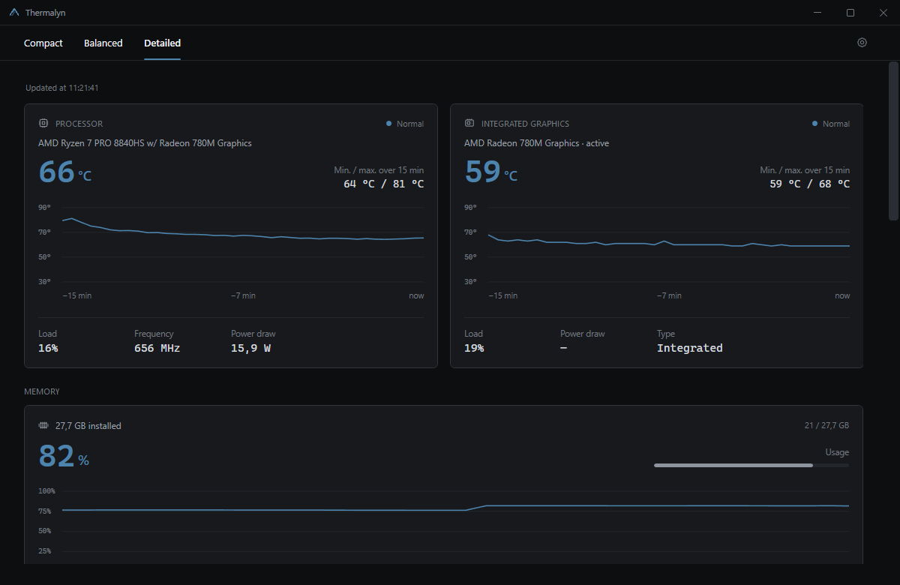

# Thermalyn

[](https://github.com/NoaSansH/Thermalyn/actions/workflows/ci.yml)
[](https://github.com/NoaSansH/Thermalyn/releases/latest)
[](https://github.com/NoaSansH/Thermalyn/releases)
[](LICENSE)

[](https://dotnet.microsoft.com/)
[](https://learn.microsoft.com/dotnet/csharp/)
[](https://learn.microsoft.com/dotnet/desktop/wpf/)
[](#install)
[](https://jrsoftware.org/isinfo.php)
[](#what-it-reports)

Hardware monitor for Windows 11. Reads processor, graphics, memory and drive sensors, keeps a
15-minute in-memory history, and stays readable whether the window is a narrow strip in a corner
of the screen or spread across a monitor. The Mini view adds session min/average/max values without
writing more data to disk.

It works offline. No account, no telemetry and no background service. Its updater only contacts
GitHub Releases to check and download a version after explicit user confirmation.



<table>
<tr>
<td width="50%"></td>
<td width="50%"></td>
</tr>
<tr>
<td align="center"><em>Compact</em></td>
<td align="center"><em>Detailed</em></td>
</tr>
</table>

## What it reports

- Processor temperature, load, effective clock and package power.
- Graphics temperature, load, clock and board power, with integrated and discrete adapters
  detected separately and the active one identified.
- Physical RAM usage, system commit usage and the applications using the most memory.
- Temperature and activity for up to four drives.
- Fan speeds where the hardware exposes them.
- A 15-minute chart per component, with the value and its age on hover.
- A history of threshold crossings: when a component went above warm or critical, for how long,
  and what peak it reached.

The interface is in English and French. It follows the Windows language on first launch and can be
changed at any time in *Settings → Language*.

## Install

Download the current release and run it.

| File | What it does |
| --- | --- |
| **`Thermalyn-Setup.exe`** | **Recommended.** Installs the application, adds shortcuts and an uninstaller, and sets up the sensor driver. Downloads the .NET runtime if the machine lacks it. |
| `Thermalyn-Portable.exe` | No installation. One file, run it from anywhere, a USB stick included. |
| `Thermalyn-Setup-Offline.exe` | The same installer with the .NET runtime included, for a machine with no internet connection. |

Or, once the package managers have accepted the submissions in
[`packaging/`](packaging/README.md):

```powershell
winget install NoaSansH.Thermalyn
scoop install https://raw.githubusercontent.com/NoaSansH/Thermalyn/main/packaging/scoop/thermalyn.json
```

[`CHANGELOG.md`](CHANGELOG.md) lists what changed in each version.

`SHA256SUMS.txt` in the same release lists the checksum of each file, so you can confirm a download
arrived intact. Every executable also carries a signed build provenance attestation, which proves it
came from this repository's workflow at that tag and was not touched afterwards:

```powershell
gh attestation verify Thermalyn-Setup.exe --repo NoaSansH/Thermalyn
```

Windows shows a reputation warning the first time, because the executable is not code-signed:
choose **More info**, then **Run anyway**. Only a paid certificate removes that screen.

### Automatic updates

Thermalyn checks the latest stable GitHub Release when it starts. If the computer is offline, it
waits for the network to return and retries after a short delay. The title-bar button shows a badge
only when a newer version exists. Downloads stay in the background; the installer size and SHA-256
checksum are verified before the **Restart and install** action becomes available. Thermalyn never
starts an installation or restarts without that explicit action.

The updater always uses `Thermalyn-Setup.exe`. This also gives portable users the normal installed
experience on their first automatic update (shortcuts, uninstaller and startup registration).

### Administrator rights

Processor temperature and power draw are not published by Windows. They require reading the
processor's own registers, which needs a kernel driver: Thermalyn reads them through
[PawnIO](https://pawnio.eu), signed and open source. The installer sets it up silently; the
portable build points you at its download page when a reading needs it.

The installer also registers a scheduled task that runs the application with the privileges it
needs. The result is that the installed build asks for elevation **once, during installation**, and
never again. The portable build has nowhere to register that task, so it prompts at every launch.

### Uninstall

*Add or Remove Programs* → Thermalyn. It removes the program files, the settings and threshold
history of every profile that used it, the single-file extraction cache, the scheduled task and the
run-at-logon entries. It asks before removing the PawnIO driver, since other monitoring tools may
depend on it.

The portable build has its own equivalent in *Settings → Data*.

## Built with

| | |
| --- | --- |
| [.NET 8](https://dotnet.microsoft.com/) and WPF | Application and interface, `net8.0-windows` |
| [LibreHardwareMonitor](https://github.com/LibreHardwareMonitor/LibreHardwareMonitor) | Sensor access, MPL-2.0 |
| [PawnIO](https://pawnio.eu) | Signed kernel driver for processor registers |
| WMI (`System.Management`) | Hardware inventory and the readings available without a driver |
| Performance counters (PDH) | Per-process graphics utilisation |
| [Inno Setup 6](https://jrsoftware.org/isinfo.php) | Installer, both variants |
| GitHub Actions | Build, tests and release |

No MVVM framework, no DI container, no charting library. Views are XAML with code-behind, charts
are drawn in `OnRender`, themes and translations are resource dictionaries swapped at runtime.

## Build it yourself

You need the [.NET 8 SDK](https://dotnet.microsoft.com/download/dotnet/8.0). Building the
installers additionally needs [Inno Setup 6](https://jrsoftware.org/isdl.php).

```powershell
git clone https://github.com/NoaSansH/Thermalyn.git
cd Thermalyn
dotnet run --project .\Thermalyn\Thermalyn.csproj
```

### Publish a version detected by the updater

1. Choose a three-part version such as `1.1.1` and add a matching `## 1.1.1` section to
   `CHANGELOG.md`.
2. Set that same version in `Thermalyn/Thermalyn.csproj`, `installer/Thermalyn.iss` and the default
   value in `tools/build-release.ps1`.
3. Commit and push those changes, then create and push the matching tag:

```powershell
git tag -a v1.1.1 -m "Thermalyn 1.1.1"
git push origin main
git push origin v1.1.1
```

The Release workflow tests and builds the project, creates `Thermalyn-Setup.exe`, writes
`SHA256SUMS.txt`, attests the executables and publishes a GitHub Release. The updater ignores normal
pushes, drafts and prereleases; it detects the new version only after this stable Release exists.

Run the checks:

```powershell
dotnet run --project .\tests\Thermalyn.Tests -- --settings --repository-contracts
```

Produce every distribution into `artifacts/release`:

```powershell
.\tools\build-release.ps1
```

It fetches the pinned PawnIO installer itself and checks its hash, refusing to continue if the
download does not match. The repository carries no copy of that binary, for the reason set out in
[`NOTICE.md`](NOTICE.md).

Regenerate the icon and the in-application logo from `installer/logo-source.png`:

```powershell
.\tools\generate-icon.ps1
```

## How it is put together

```
Thermalyn/
  Services/          sensor reading, selection, localization, settings, startup, tray
  Controls/          history chart, component card, icon, colour wheel
  Themes/            icons, and one string table per language
  MainWindow.*.cs    one file per concern: content, layout, settings, monitoring, theme
tests/               deterministic checks, plus a probe that dumps real sensors
tools/               release build, icon generation, artifact verification
installer/           Inno Setup script, licences, setup icon
```

Two things to know before changing anything.

`SensorSelector` matches verified sensor names exactly and leaves unknown readings unavailable.
[`docs/sensors.md`](docs/sensors.md) documents the supported mappings.

Readings run on worker threads, the UI updates on the dispatcher. Anything a worker touches has to
be thread-safe by itself — that's why `LocalizationService` snapshots its strings instead of
reading the ResourceDictionary live.

## Who maintains it

Thermalyn is maintained by one person: [@NoaSansH](https://github.com/NoaSansH). Every change is reviewed, tested and approved by the maintainer, who publishes every release. Releases are built by GitHub Actions from a tag, never from a developer machine, and
each binary carries a signed provenance attestation.

Contributions are welcome through pull requests; see [`CONTRIBUTING.md`](CONTRIBUTING.md).

## Licence

Copyright (C) 2026 Thermalyn Project.

Thermalyn is free software: you may redistribute it and modify it under the terms of the GNU
General Public License as published by the Free Software Foundation, either version 3 of the
licence or, at your option, any later version. The full text is in [`LICENSE`](LICENSE).

You may use it commercially. The condition is that anything you distribute built on it comes with
its own source under the same licence, so it stays as open as what you received.

It is distributed in the hope that it will be useful, but WITHOUT ANY WARRANTY, without even the
implied warranty of MERCHANTABILITY or FITNESS FOR A PARTICULAR PURPOSE.

Third-party components and their terms are listed in [`NOTICE.md`](NOTICE.md). One of them settles
the version: HidSharp is Apache-2.0, which is compatible with GPL version 3 and not with version 2.
